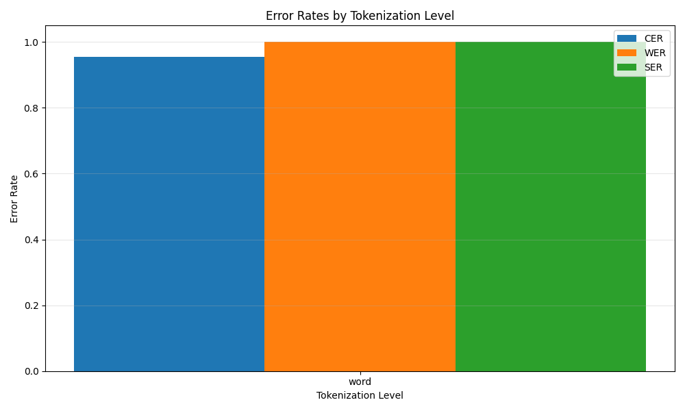
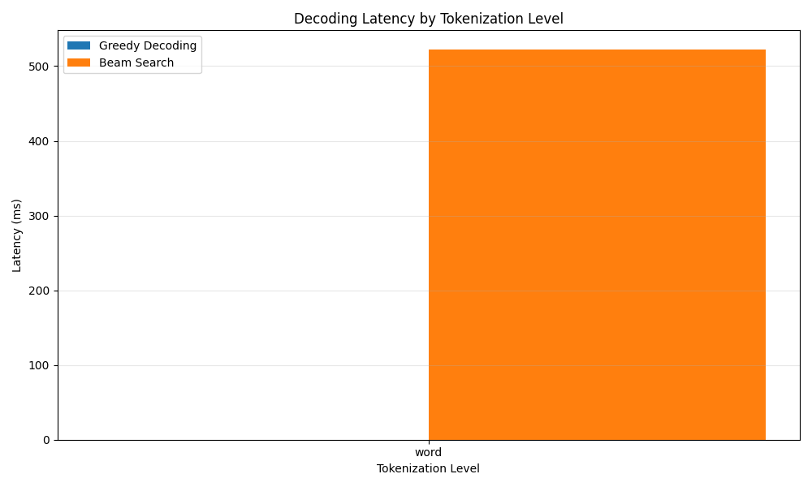

# Vietnamese ASR Tokenization Evaluation Report

## Summary

| Tokenizer | CER | WER | SER | Greedy Time (ms) | Beam Time (ms) |
| --- | --- | --- | --- | --- | --- |
| word | 0.9547 | 1.0000 | 1.0000 | 0.00 | 521.85 |

## Comparison Plots

### Error Rates by Tokenization Level

### Decoding Latency by Tokenization Level

### Accuracy vs. Speed Trade-off

## Analysis and Recommendations

### Tokenization Level Comparison

- **Character-level:**
  - Pros: Smallest vocabulary, no OOV issues, handles all Vietnamese characters
  - Cons: Longer sequences, slower decoding, requires stronger language model
  - Best for: Maximum coverage of Vietnamese text, handling rare words

- **Subword-level (BPE):**
  - Pros: Good balance between vocabulary size and sequence length, handles word variations
  - Cons: May produce suboptimal segmentation for Vietnamese
  - Best for: General-purpose ASR with good balance of accuracy and speed

- **Syllable-level:**
  - Pros: Natural unit for Vietnamese, shorter sequences than characters
  - Cons: Larger vocabulary than characters, potential OOV issues
  - Best for: Vietnamese-specific ASR where syllables are well-defined

- **Word-level:**
  - Pros: Shortest sequences, fastest decoding, direct mapping to meaning
  - Cons: Largest vocabulary, significant OOV issues, requires word segmentation
  - Best for: Domain-specific applications with limited vocabulary, real-time requirements

### Recommendations

- **For real-time applications:** Consider syllable or word-level tokenization with greedy decoding
- **For maximum accuracy:** Use character or subword-level with beam search and a strong LM
- **For Vietnamese-specific applications:** Syllable-level tokenization offers a good balance
- **For general-purpose ASR:** Subword-level (BPE) with 5,000-10,000 tokens provides flexibility
